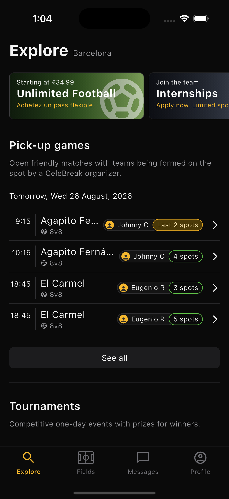
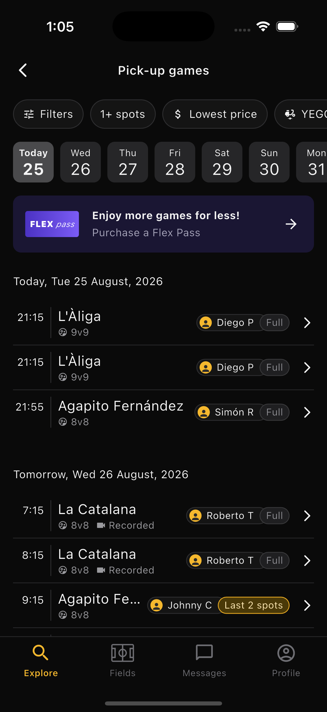
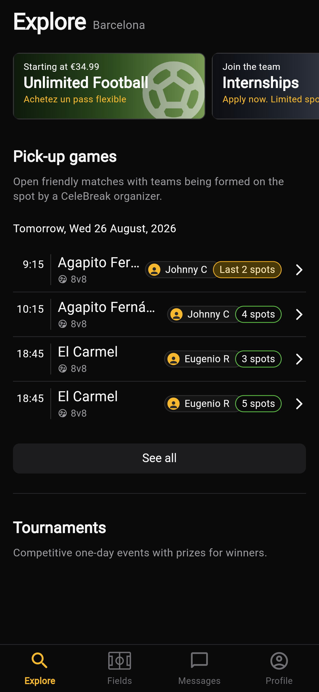
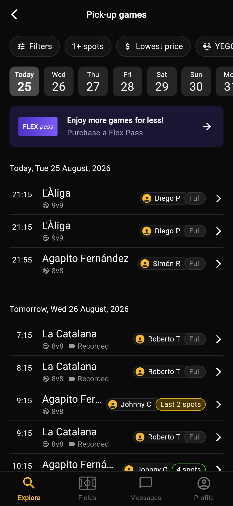
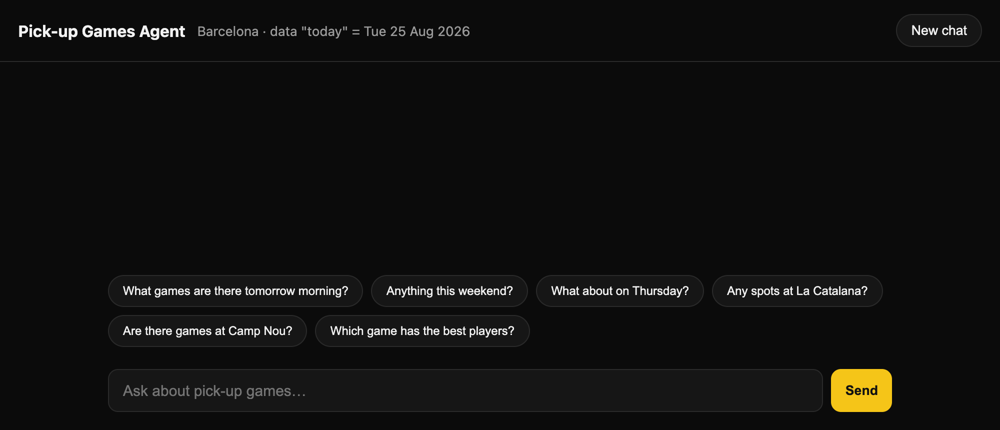
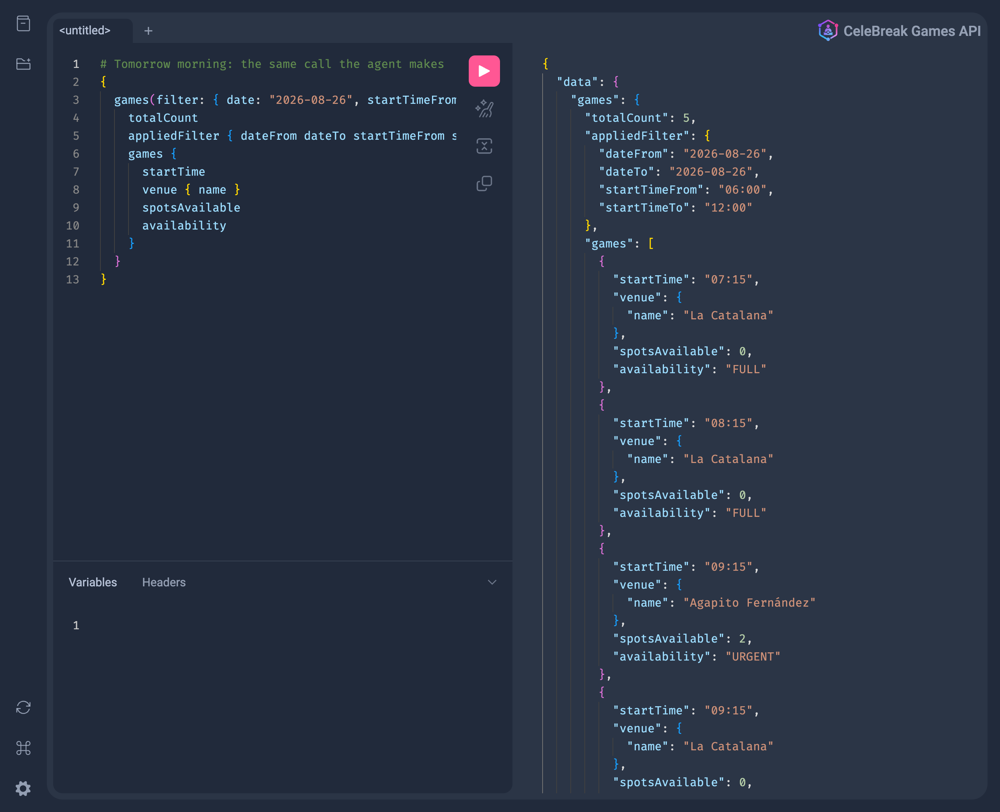

# Explore Screens + Games Q&A Agent (Barcelona)

Two parts built on **one** small GraphQL API:

| Folder | What | Stack |
|---|---|---|
| [`api/`](api) | Games GraphQL API (mock data behind it) | Node 20+, TypeScript, graphql-yoga |
| [`app/`](app) | Explore home + Pick-up games list | Flutter 3.44.8, `graphql` client |
| [`agent/`](agent) | Minimal chat agent with the API exposed as tools | Node 20+, Google Gemini (`@google/genai`) |

The Flutter screens and the agent both read from the same API, which serves `api/data/games.json`.

> **Reference "today" in the mock data: Tuesday 25 August 2026, Europe/Madrid.**
> The API exposes it as `referenceDate { today }`. The app labels "Today"/"Tomorrow" from it,
> and the agent resolves "tomorrow", "this weekend" and "on Thursday" against it.
> Tomorrow is Wed 26 Aug. This weekend is Sat 29 to Sun 30 Aug. "On Thursday" is 27 Aug.

| | Explore home | Pick-up games |
|---|---|---|
| **iOS simulator** |  |  |
| **Chrome, web build** |  |  |

Every screenshot reads live from the local API. The iOS ones come from an iPhone 16 Pro simulator.
The Chrome ones come from `flutter build web` in a phone-sized window.

**Web pages**

| Agent chat at `localhost:3001` | API explorer (GraphiQL) at `localhost:4000/graphql` |
|---|---|
|  |  |

The chat page is shown before any question, because a real conversation needs a Gemini key.
The API explorer is running the same "tomorrow morning" query the agent sends.

---

## How to run

### 1. API (start this first)

```bash
cd api
npm install
npm start            # http://localhost:4000/graphql  (GraphiQL in the browser)
npm test             # unit tests for filtering/validation
```

### 2. Flutter app

Install Flutter 3.44.8 first if you don't have it. A shallow clone of the release tag is the fastest route:

```bash
git clone --depth 1 --branch 3.44.8 https://github.com/flutter/flutter.git ~/development/flutter
```

```bash
export PATH="$HOME/development/flutter/bin:$PATH"
```

Then run the app:

```bash
cd app
flutter pub get
flutter run          # iOS simulator, Android emulator, Chrome or macOS
flutter build web    # static site in build/web, which any static file server can serve
flutter test         # widget + unit tests (no API needed, uses an in-memory fake)
```

The app calls `http://localhost:4000/graphql`, or `http://10.0.2.2:4000/graphql` on the Android emulator.
Override it with `--dart-define=GAMES_API_URL=http://<host>:4000/graphql`, for example on a physical device.

### 3. Agent

```bash
cd agent
npm install
cp .env.example .env # then paste a free key from https://aistudio.google.com/apikey into GEMINI_API_KEY
npm start            # chat UI at http://localhost:3001
npm test             # date-resolution + agent-loop tests (no key needed)
npm run eval         # runs the 5 required conversations against Gemini and checks them
npm run eval -- --report eval.md   # same, and writes the transcript as Markdown
```

The server starts without a key too. The chat then replies with setup instructions instead of calling the model.

`GEMINI_MODEL` defaults to `gemini-flash-lite-latest`, the alias Google keeps pointed at its current Flash Lite model.
On 13 Sep 2026 it served Gemini 3.5 Flash Lite. Flash Lite is the default because the free tier gives it far more room:

| Free-tier model | Requests per minute | Requests per day |
|---|---|---|
| Gemini 3.5 Flash Lite, the default | 15 | 500 |
| Gemini 3.8 Flash | 5 | 20 |

These limits come from AI Studio's rate-limit page for this project on 13 Sep 2026, and they can differ per account.
Each question costs about two requests, and one eval run about 12, so Flash's daily limit is used up after one or two runs.
Set `GEMINI_MODEL=gemini-flash-latest` for the stronger model. The Gemini 2.5 models are already closed to new keys.

---

## Part 1: screens

- **Explore home**: the title with its city, the promo carousel, the Pick-up games intro, and the next day that still has joinable games (up to 4 rows). Then "See all", the start of Tournaments, and the bottom bar.
  Today's games in the data are all full, so the preview shows **Tomorrow, Wed 26 August, 2026**, exactly like the screenshot.
- **Pick-up games**: back button with a centered title, then the filter chips, the date selector, the Flex Pass banner, and games grouped under day headers.
  - **1+ spots** re-queries the API with `minSpotsAvailable: 1`, which hides full games. Filters, Lowest price and YEGO are inert, as allowed.
  - **Date selector**: tapping a day scrolls its section to the top. Scrolling the list updates the selected day. Days without games still get a header with an empty-state line, so every tile has a target.
- **Shared game row** (`app/lib/widgets/game_row.dart`): the time sits left of a thin divider. The venue name truncates with an ellipsis. Below it are the format and "Recorded" tags, then the organizer chip and a color-coded availability chip. The whole row is tappable.
  - Urgent means 1 or 2 spots left and uses an amber fill ("Last 2 spots").
  - Available means 3 or more spots and uses a green outline ("4 spots").
  - Full uses neutral gray ("Full").
- The **bottom bar** stays visible on pushed screens because each tab owns a nested `Navigator`. Fields, Messages and Profile are placeholders.
- Tapping a row opens a **placeholder detail screen**, which loads through the API's `game(id)` query.

---

## Part 2a: API design decisions

The API is meant to be consumed by a language model, so it favors being **unambiguous, self-describing and hard to misuse**.

1. **Every type, field and argument has a description.** An agent that introspects the schema learns units, formats and semantics, such as "0 means the game is full" and "morning = 06:00 to 12:00".
2. **No ambiguous dates or times.**
   - `date` is an ISO calendar date (`YYYY-MM-DD`) in the venue's local timezone.
   - `startTime` and `endTime` are 24h `HH:mm` local times, and `timezone` names the IANA zone.
   - `startsAt` keeps the explicit UTC offset.
   - Relative words like "tomorrow" are **rejected**. The client has to resolve them, and `referenceDate` gives it the anchor to do so deterministically.
3. **Strict validation with actionable errors.** A malformed date, an inverted range, a negative spot count, or `date` combined with `dateFrom`/`dateTo` all fail with a `BAD_USER_INPUT` error. The message states the expected format. Nothing silently falls back to "return everything".
4. **The server echoes what it applied.** `games` returns `{ totalCount, games, appliedFilter }`, so the caller can check that the server understood its intent.
5. **Empty is a normal answer.** Unknown venues or empty days return `totalCount: 0` and `games: []`, never null and never an error. `game(id)` returns null for a missing id.
6. **Derived state lives on the server.** `availability` is a closed enum of `URGENT`, `AVAILABLE` and `FULL`, computed from `spotsAvailable`, so the app and the agent can't disagree on the thresholds.
7. **Forgiving where it is safe.** `venueName` matching ignores case and accents, so "aliga" finds "L'Àliga". `venueId` gives an exact match. Filters combine with AND.
8. **Bounded and ordered.** Results are sorted by kick-off. The `first` argument defaults to 100, capped at 500.
9. **Read-only.** There are no mutations, so a model driving the API cannot change anything.

```graphql
type Query {
  games(filter: GamesFilter, first: Int = 100): GamesResult!
  game(id: ID!): Game
  venues: [Venue!]!
  referenceDate: ReferenceDate!
}
input GamesFilter {
  date: Date  dateFrom: Date  dateTo: Date          # one day OR an inclusive range
  venueId: ID  venueName: String                    # exact id or fuzzy name
  minSpotsAvailable: Int                            # 1 = hide full games
  availability: [Availability!]
  startTimeFrom: String  startTimeTo: String        # HH:mm window, e.g. "morning"
}
```

Example:

```graphql
{ games(filter: { date: "2026-08-26", startTimeFrom: "06:00", startTimeTo: "12:00" }) {
    totalCount appliedFilter { dateFrom dateTo startTimeFrom startTimeTo }
    games { startTime venue { name } format spotsAvailable availability } } }
```

**Data source.** By default the API serves `api/data/games.json`, which holds 19 games across 25 to 31 August at 5 venues. The repository layer also has an optional Supabase backend, used only when `SUPABASE_URL` and `SUPABASE_SERVICE_ROLE_KEY` are set. Its schema and seed are in `api/supabase/migrations`, and `npm run seed:sql` regenerates the seed from the JSON. Both sources share the same pure filter code, so they answer identically.

---

## Part 2b: agent design

The agent lives in `agent/src`: `agent.ts` runs the loop, `tools.ts` holds the tools, and `calendar.ts` resolves dates.

- **Tools**: `search_games`, `get_game_details` and `list_venues`. Each is a thin, typed wrapper over one GraphQL query.
- **Deterministic dates.** Models are unreliable at weekday arithmetic. Every turn, the system prompt gets a 14-day calendar built from the API's `referenceDate`, plus the pre-resolved meanings of today, tomorrow, this weekend, next weekend and "on <weekday>". Time-of-day words map to explicit `HH:mm` windows that the API filters server-side.
- **Grounding.**
  - The prompt requires a tool call before any claim about games.
  - Tool results come back grouped by date, and each carries a `note`. An empty result says "NO games match… say so plainly". A multi-day result says "Results span N dates… break down per day or ask".
  - API errors return to the model as structured data with a hint to fix the arguments. They never crash the loop, so the model never has to fall back to memory.
- **Honest limits.** The prompt lists exactly which fields exist, which also tells the model what is missing: player skill, ratings, weather, facilities, booking. Questions about those get "that isn't available" instead of a guess.
- **Retries.** The free tier often answers "rate limited" or "high demand" for a few seconds, so the Gemini client retries those errors with backoff before giving up.
- **Bounded loop.** A turn allows at most 6 tool rounds. Chat sessions are kept in memory, and the UI shows each tool call and its raw result under the answer, so grounding can be audited.

The required conversations and what the data makes them test:

| # | Question | Expected behavior with this data |
|---|---|---|
| 1 | "What games are there tomorrow morning?" | Calls `search_games(date 2026-08-26, 06:00 to 12:00)`. Lists 7:15, 8:15 and 9:15 at La Catalana (Full), 9:15 at Agapito Fernández (Last 2 spots), and 10:15 at Agapito Fernández (4 spots). |
| 2 | "this weekend" / "on Thursday" | Resolves to 2026-08-29 to 2026-08-30 and to 2026-08-27. |
| 3 | A day with no games, such as 5 September | Says plainly that there are none. |
| 4 | "Any spots at La Catalana?" | La Catalana has games on 26, 27, 29 and 31 Aug, so the answer is broken down per day or asks which day. |
| 5 | "Which game has the best players?" | States that the data has no player or skill information. |

`npm run eval` runs these conversations against the real model and asserts on both the tool arguments and the reply.
It also checks every reply against the tool results of its conversation:

- Every time, match format, price and spot count in the reply must appear in a tool result.
- A real venue can only be named after a tool returned it.
- General claims the data can't support fail the case, such as "games are open to all levels".

The check lives in `agent/src/grounding.ts` and has its own unit tests.
It was added after a run on Gemini 3.8 Flash answered the "best players" question correctly, then claimed that games are open to all skill levels and gave 7v7 as an example format.
Neither comes from the data. Rule 4 of the system prompt now forbids both, and the eval would fail such an answer.

### Test conversations and the responses we got

The transcript below is the latest run, word for word. Expand a conversation to see the tool call and the answer.

Recorded on 2026-09-13 with `gemini-flash-lite-latest`, answered by `gemini-3.5-flash-lite`. 6/6 cases passed.

<details>
<summary><b>1. Simple question (tomorrow morning)</b>: passed</summary>

**User:** What games are there tomorrow morning?

**Tool call:** `search_games({"date":"2026-08-26","start_time_to":"12:00","start_time_from":"06:00"})`, 5 games returned

**Agent:**

> Here are the games for tomorrow morning (Wednesday, 26 August 2026):
>
> * 07:15 — La Catalana (8v8) — Full
> * 08:15 — La Catalana (8v8) — Full
> * 09:15 — Agapito Fernández (8v8) — 2 spots left
> * 09:15 — La Catalana (8v8) — Full
> * 10:15 — Agapito Fernández (8v8) — 4 spots left

</details>

<details>
<summary><b>2a. Relative date: this weekend</b>: passed</summary>

**User:** Anything this weekend?

**Tool call:** `search_games({"date_from":"2026-08-29","date_to":"2026-08-30"})`, 4 games returned

**Agent:**

> Here are the games available this weekend:
>
> **Saturday 29 August 2026**
> - 10:00 — La Catalana (8v8) — 7 spots left
> - 18:00 — Camp Municipal de Futbol Can Dragó (11v11) — 8 spots left
>
> **Sunday 30 August 2026**
> - 11:00 — El Carmel (8v8) — 2 spots left
> - 19:00 — L'Àliga (9v9) — 5 spots left

</details>

<details>
<summary><b>2b. Relative date: on Thursday</b>: passed</summary>

**User:** What about on Thursday?

**Tool call:** `search_games({"date":"2026-08-27"})`, 2 games returned

**Agent:**

> Here are the games for Thursday, 27 August 2026:
>
> * 19:30 — La Catalana (8v8) — 6 spots left
> * 21:00 — L'Àliga (9v9) — 1 spot left

</details>

<details>
<summary><b>3. Grounded: empty result</b>: passed</summary>

**User:** Are there any games on 5 September?

**Tool call:** `search_games({"date":"2026-09-05"})`, 0 games returned

**Agent:**

> There are no games scheduled for Saturday 5 September 2026. Games are currently scheduled through Monday 31 August 2026.

</details>

<details>
<summary><b>4. Ambiguity: La Catalana across several days</b>: passed</summary>

**User:** Any spots at La Catalana?

**Tool call:** `search_games({"min_spots_available":1,"venue_name":"La Catalana"})`, 3 games returned

**Agent:**

> Yes, there are available spots at La Catalana across several days:
>
> **Thursday, 2026-08-27**
> * 19:30 — La Catalana (8v8) — 6 spots left
>
> **Saturday, 2026-08-29**
> * 10:00 — La Catalana (8v8) — 7 spots left
>
> **Monday, 2026-08-31**
> * 20:30 — La Catalana (8v8) — 10 spots left

</details>

<details>
<summary><b>5. Honest about limits</b>: passed</summary>

**User:** Which game has the best players?

**Tool calls:** none

**Agent:**

> I don't have information about player skill levels, ratings, or player quality. I can only provide details on game dates, kick-off times, venues, formats, spots available, prices, and organizers. 
>
> If you'd like to check available games for a specific day, time, or venue, let me know!

</details>

---

## What has been verified

| Check | Result |
|---|---|
| API unit tests (`api`, `npm test`) | 8 passing |
| Agent tests: date resolution, tool loop with a scripted model, grounding check (`agent`, `npm test`) | 12 passing |
| Flutter analyzer and tests (`app`, `flutter analyze`, `flutter test`) | 0 issues, 10 passing |
| App on the iOS simulator against the live API | Both screens, "1+ spots", date jump, row detail and tab bar all work |
| App as a web build in headless Chrome against the live API | Both screens render with live data, and "See all" opens the list |
| Agent tools called directly against the live API | Morning window, empty day, bad date and unknown id all return the expected structured data |
| Supabase migrations on a throwaway Postgres 17 | Schema and seed apply, the seed re-runs safely, counts match the JSON |
| Supabase read path in the API | Not run, because it needs a Supabase project |
| Agent against Gemini (`npm run eval`) | All 6 conversations pass on Gemini 3.5 Flash Lite, with every time, format, price, spot count and venue checked against the tool results. The transcript is in Part 2b |

---

## What I cut, and what I'd do with more time

- **Promo images**: the carousel cards use gradients and glyphs instead of photos, to avoid shipping third-party imagery. Swapping in `Image.asset` is a one-line change per card.
- **Availability colors**: the screenshot shows "5 spots" with a gray outline, but the spec defines only three states, so every available game gets the green outline. With a design answer, a fourth "plenty" state is easy to add as another enum value.
- **Only "1+ spots" works.** Filters, Lowest price and YEGO are visual only. The API already supports price data and more filters, so wiring them is mostly UI work.
- **No pagination.** `first` bounds the result size. A real API would use cursor pagination.
- **Agent quality.** With more time I'd:
  - turn the eval's grounding check into a runtime guard that regenerates or blocks a reply that fails it,
  - add a golden-set eval in CI with a pinned model,
  - consider exposing the schema to other agents through MCP.
- **Deployment** is deliberately left out until the hosting target is decided. The Supabase schema is ready, and the Flutter web build is a static site that any static host can serve. A serverless entry point for the API is a small addition once the platform is chosen.

The five areas below each start with what already exists, checked against the code, and then list what I'd add.

### Async processing

**In place:** all I/O is non-blocking. The app loads data with futures and shows loading and error states. Each agent call to the API times out after 10 seconds, and a turn stops after 6 tool rounds. There are no background jobs, queues or scheduled tasks, and the chat request waits for the whole answer.

**Next:**
- **Stream the agent's reply** over server-sent events, so text and tool calls appear as they happen.
- **Queue booking writes** once bookings exist, for example with Supabase Queues. Idempotency keys make retries safe, so a retry never books twice.
- **Scheduled jobs with pg_cron** to close games at kick-off, send reminders two hours before, and clear expired chat sessions.
- **An outbox table**: a trigger records each change as an event in the same transaction, and a worker turns events into notifications and cache invalidations. Nothing is lost while a worker is down.
- **Run the Gemini eval on a schedule** in CI, so a model update that breaks grounding is caught early.

### Push notifications and live updates

**In place:** nothing yet. The app fetches when a screen opens or when "1+ spots" is toggled. There is no pull-to-refresh and no live update.

**Next:**
- **Push through Firebase Cloud Messaging**, which reaches iOS through APNs. A `device_tokens` table holds one row per user and device.
- **Events worth a notification**: a spot opens in a full game you're waitlisted for, a game you joined starts in two hours, a saved game drops to its last two spots, or an organizer changes or cancels a game.
- **Deep links** from each notification to the game's detail screen.
- **Live availability** through GraphQL subscriptions, which graphql-yoga serves over server-sent events, or Supabase Realtime on the games table. The availability chip would update without a refresh.
- **Pull-to-refresh** on both screens as a simple fallback.
- **User control**: opt-outs per notification type, quiet hours, and a daily cap per user.

### Database: triggers, functions, procedures and views

**In place:** three tables with foreign keys and check constraints. The checks cover spot ranges, non-negative prices, the local time format, and agreement between the UTC and local kick-off times. Kick-off time and venue are indexed, every table has row-level security, and the seed can be re-run safely. There are no triggers, functions, procedures or views yet. The Supabase path also loads every row and filters in Node, which is fine for 19 games but not for thousands.

**Next:**
- **A `games_with_availability` view** that joins venue and organizer and computes the urgent, available or full state in SQL, so the thresholds live in one place.
- **A `search_games` function** called through Supabase RPC, so filtering runs in Postgres. It would use `unaccent` for accent-insensitive venue names and a trigram index for fuzzy matches.
- **A bookings table and a `join_game` function** that locks the game row, checks spots and inserts the booking in one transaction, so two players can never take the last spot at once. Supabase's API calls functions rather than `CALL` procedures, so this is where the stored-procedure logic would live.
- **An `archive_past_games` procedure** that pg_cron runs nightly. It moves finished games to an archive table in batches and commits between batches.
- **Triggers** that keep `spots_available` in step with bookings, maintain `updated_at`, reject bookings for full or started games, and write the outbox events.
- **A materialized view of games per day**, refreshed by pg_cron, to put cheap counts on the date selector.
- **Database tests with pgTAP**, so constraints, policies and functions are checked in CI.

### Caching

**In place:**
- The JSON source loads once at startup.
- The Supabase source keeps the whole dataset in memory for 15 seconds, separately in each API instance.
- The app has an in-memory GraphQL cache but reads network-only, so spot counts are always fresh. That is deliberate, since stale availability is worse than a slower screen.
- The agent fetches the reference date on every turn.

**Next:**
- **Response caching in the API** with graphql-yoga's response-cache plugin, keyed by query and variables and invalidated by game id when spots change.
- **A shared cache such as Redis** once there is more than one API instance, because per-instance caches drift apart.
- **CDN caching for list queries** by sending persisted queries as GET with a short `s-maxage` and `stale-while-revalidate`.
- **Event-driven invalidation** from the outbox or Supabase Realtime instead of a fixed 15-second window.
- **Cache-and-network in the app** with a persistent store, so screens open instantly from the last result, refresh in the background, and work offline.
- **Never trust a cached spot count for a booking.** The `join_game` function re-checks inside its transaction.
- **Agent**: cache the reference date for the day and reuse identical tool results within a conversation.

### Security

**In place:**
- The API is read-only. It validates every input with clear errors and caps `first` at 500.
- Every table has row-level security with no public policies, so the public Supabase key reads nothing. The service-role key only comes from the API's environment.
- `.env` files are gitignored, and only empty templates are committed.
- The agent can only call three read-only tools. Messages are capped at 2,000 characters and request bodies at 64 KB. The server issues session IDs as random UUIDs.
- Android allows plain HTTP only in debug builds.

**Next:**
- **Authentication** with Supabase Auth, plus per-user row-level security policies once bookings exist.
- **Least privilege**: the service-role key bypasses row-level security. A read-only role or a select-only policy for public game data should replace it.
- **Rate limits** per IP and per session on `/graphql` and `/api/chat`. The chat comes first, because every message spends Gemini quota.
- **GraphQL hardening**: depth and cost limits, a persisted-query allowlist, and masked errors in production. Today raw error messages go back to the caller, and GraphiQL and introspection are always on. Yoga's masking still lets the intentional validation messages through.
- **Tighter CORS**: any origin can call the API today. Only the app's own origins should.
- **Agent sessions**: expire idle sessions and cap history length, since the in-memory map grows without limit. Error replies should stop echoing raw exception text.
- **Prompt-injection defense** if venue or organizer names ever become user-generated. Tool output stays data, and the reply guard from the agent section applies.
- **Transport and headers**: HTTPS only, the iOS local-network exception limited to debug builds, and a Content-Security-Policy and HSTS on the chat page.
- **Supply chain**: Dependabot, `npm audit` and GitHub secret scanning.
